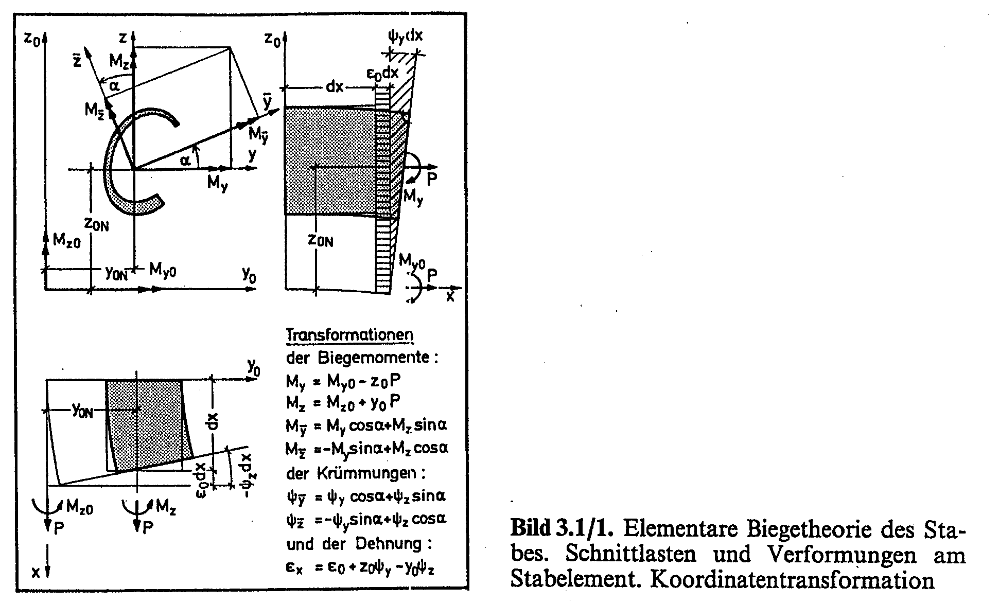

====================================================
Normal and Bending Stresses in Simple Cross Sections
====================================================

******
Theory
******

* closed polygon
* counterclockwise
* must not intersect itself

Symbols
=======

=============== ===================================================== 
y0, z0          arbitrary (reference) axis system
y0C, z0C        coordinates of section centroid
y, z            axes parallel to y0, z0, origin in section centroid
ybar, zbar      principal axis system, ybar major, origin in centroid
iy0, iz0, iyz0  moments of inertia in reference system
iy, iz, iyz     moments of inertia in centroid axis system
i1, i2          principal moments of inertia, i1 >= i2
Iybar, Izbar    principal moments of inertia, Iybar > Izbar
phi1            angle between y and ybar, direction of major principal axis
phi2            direction of minor principal axis
A               area of cross section
r1, r2          radii of gyration
=============== ===================================================== 

Properties in Reference System
==============================

Area 

.. math::
   A = \int_{\Omega} \mathrm{d}y_0 \mathrm{d}z_0

   
Centroid 

.. math::
   y_{0C} = \frac{1}{A} \int_{\Omega} y_0 \mathrm{d}y_0 \mathrm{d}z_0

.. math::   
   z_{0C} = \frac{1}{A} \int_{\Omega} z_0 \mathrm{d}y_0 \mathrm{d}z_0
    
    
Moments of Interia

.. math::

    I_{y0} = \int_{\Omega} z_0^2\, \mathrm{d}y_0 \mathrm{d}z_0
    
.. math::

    I_{z0} = \int_{\Omega} y_0^2\, \mathrm{d}y_0 \mathrm{d}z_0
 
.. math::

    I_{yz0} = \int_{\Omega} y_0 z_0\, \mathrm{d}y_0 \mathrm{d}z_0

    
Properties in Centroid System
=============================

.. math::

    I_y = I_{y0} - z_{0C}^2 A
    
.. math::

    I_z = I_{z0} - y_{0C}^2 A
 
.. math::

    I_{yz} = I_{yz0} - y_{0C} z_{0C} A

Principal Axes System
=====================

Principal moments of inertia. :math:`I_\bar{y}` is the larger one.

.. math::

    I_{\bar{y}} = \frac{1}{2} \left[ (I_y + I_z) + \sqrt{(I_y - I_z)^2 + 4I_{yz}^2} \right]
    
    
.. math::

    I_{\bar{z}} = \frac{1}{2} \left[ (I_y + I_z) - \sqrt{(I_y - I_z)^2 + 4I_{yz}^2} \right]
 
Radii of gyration

.. math::

    r_{\bar{y}} = \sqrt{\frac{I_{\bar{y}}}{A}}

.. math::

    r_{\bar{z}} = \sqrt{\frac{I_{\bar{z}}}{A}}

Direction of Principal Axes

.. math::

    \tan 2\phi = \frac{2 I_{yz}}{I_z - I_y}

Here add some remarks how to find which direction belongs to major
axis and which to the minor.

Applied Loads
=============

Normal force :math:`N` and bending moments :math:`M_{yP}`, :math:`M_{zP}` 
applied at some load application point P.
P is given in reference system: :math:`y_{0P}`, :math:`z_{0P}`.

Moments with respect to centroid:

.. math::

    M_y = M_{yP} - (z_{0C} - z_{0P}) N

.. math::

    M_z = M_{zP} + (y_{0C} - y_{0P}) N

Moments with respect to principal axes:

.. math::

    M_{\bar{y}} = M_y \cos \phi + M_z \sin \phi
    
.. math::

    M_{\bar{z}} = - M_y \sin \phi + M_z \cos \phi

    
Stresses
========

.. math::

    \sigma(\bar{y}, \bar{z}) = \frac{N}{A} + \bar{z} \frac{M_{\bar{y}}}{I_{\bar{y}}} - \bar{y} \frac{M_{\bar{z}}}{I_{\bar{z}}}

For that, we need to transform point coordinates into principal axis system.
Given some point V (y0V, z0V), what are coordinates :math:`\bar{y}_V`?

Point in centroiid system y,z:

.. math::

    y_V = y_{0V} - y_{0C}
    
.. math::

    z_V = z_{0V} - z_{0C}
    
Point in principal axes system:

.. math::

    \bar{y}_V = y_V \cos \phi + z_V \sin \phi
    
.. math::

    \bar{z}_V = - y_V \sin \phi + z_V \cos \phi
    

